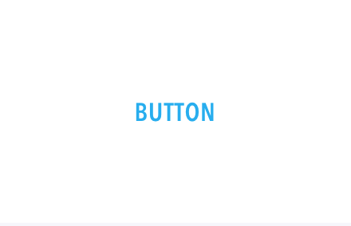
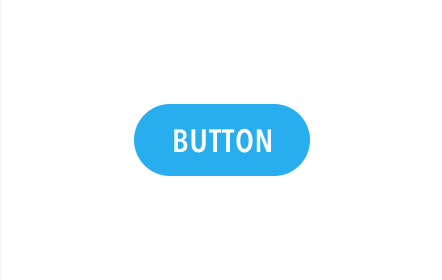
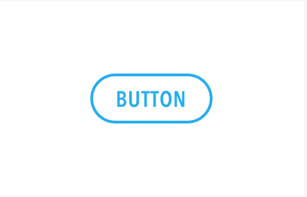
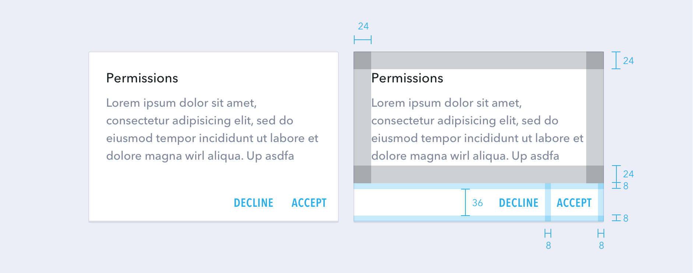
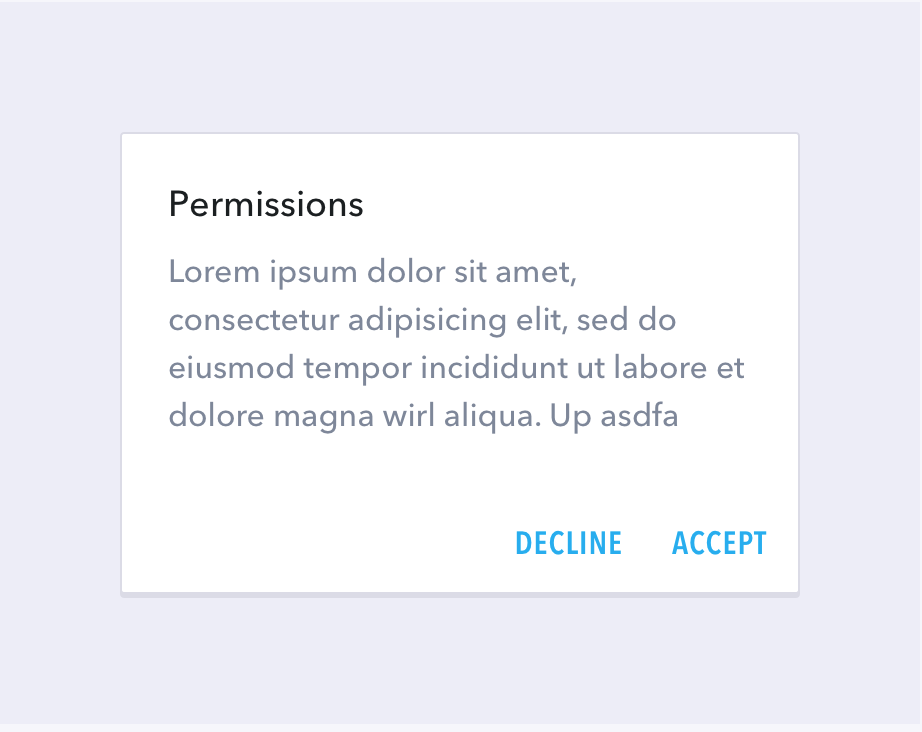
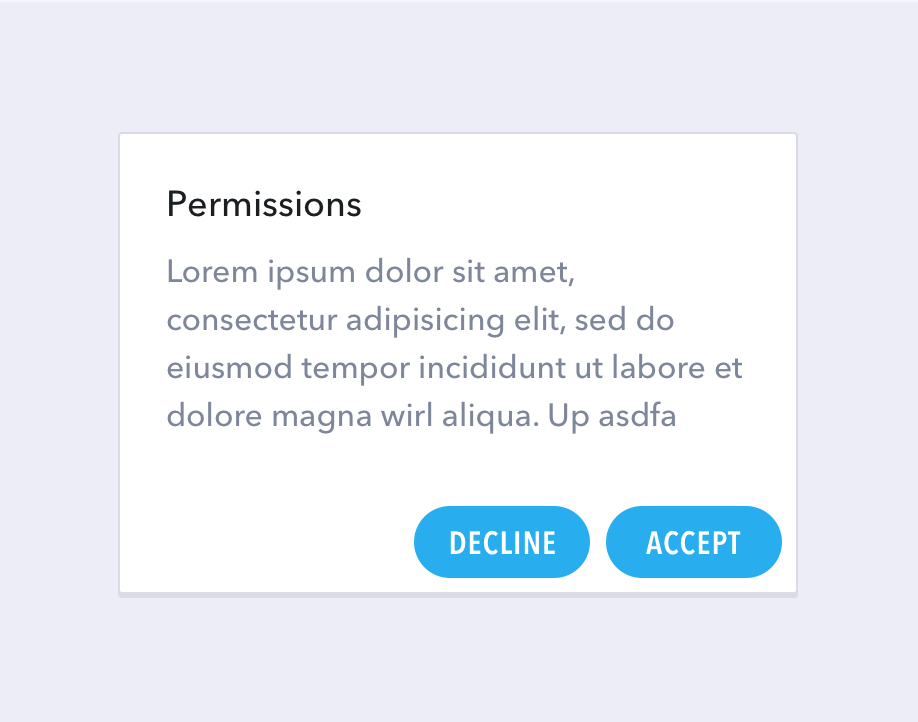

# Components - Buttons

Choosing a button style depends on the primacy of the button, the number of containers on screen, and the screen layout

## Button Types

There are four standard types of buttons.

#### Action

Function: Is it important and ubiquitous enough to be an action button?

#### Clear

Layout: Use primarily one type of button per container. Only mix button types when you have a good reason to, such as emphasizing an important function.

#### Solid

Dimension: Choose raised or flat depending on the container it will be in and how many z-space layers you have on screen. There should not be many layers of objects on the screen.

#### Outlined

Secondary: Use for secondary button features when used in-line with a solid button.

## Buttons in dialog

Use clear buttons on dialogs to unify the button action with the dialog content.

*   Dialogue text padding: 24dp
*   Dialogue button container height: 52dp
*   Dialogue buttons: 8dp padding from container edges, aliigned to the right of container (for LTR scripts)

#### Do:

Always use clear buttons for dialogs and when buttons are set side by side. This allows for minimal distraction.

#### ~~Don't~~:

Solid buttons may become a distraction. Do not use solid buttons in dialogs, especially when they are consecutive.

